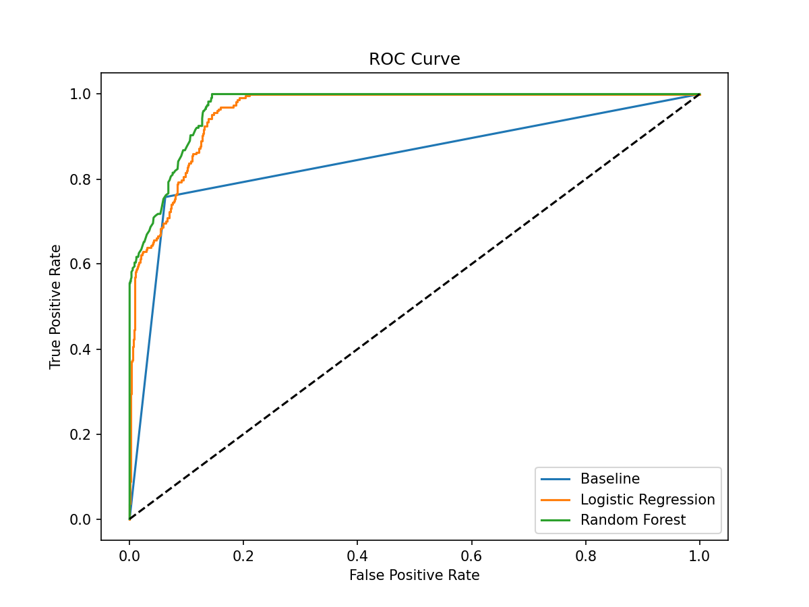
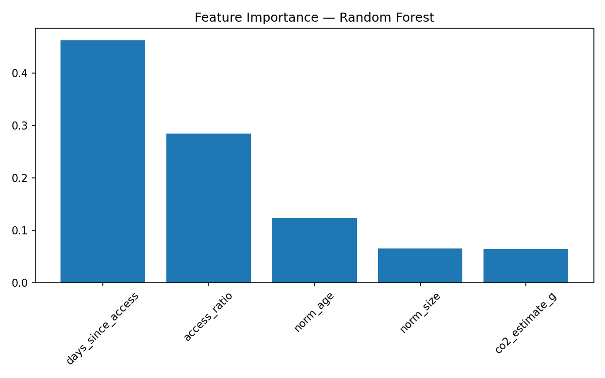
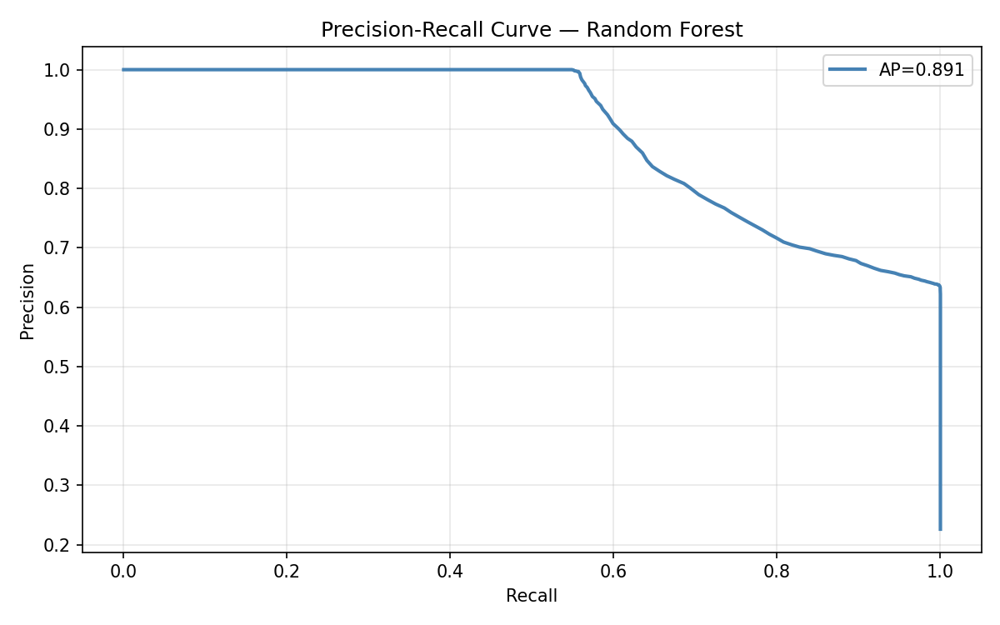
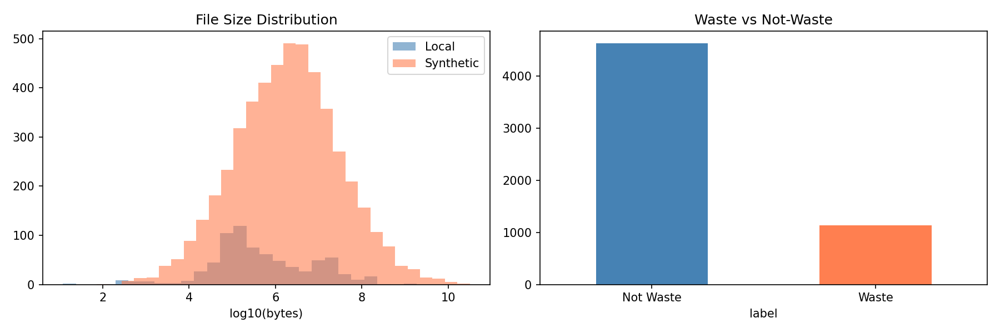

# Digital Waste System

In school, we did a project on physical waste collection — sorting, measuring, figuring out what people throw away without thinking. At some point I started wondering if the same thing happens with digital files. Nobody audits their storage. Files pile up, get forgotten, and keep consuming energy for years after they become useless.

So I built a system to measure it. It scans file metadata, models waste behavior, and estimates the CO₂ cost of data nobody uses.

I ran it on my own machine. Out of 736 files, it flagged 1 (~2.7 MB) — my laptop is actively used, so that's expected. The more interesting results came from simulating different user types.

---

## What it does

Scans file metadata from three sources, engineers behavioral features, trains ML models to classify files as waste or not-waste, and simulates how different user types accumulate storage debt over time.

```
Local Scanner (SHA-256 anonymized)    ↘
Synthetic Generator (100K files)      → Merge → Features → Labeling → Models → Evaluation
Unsplash API (real photo metadata)    ↗                                            ↓
                                                              Simulation + Hypothesis Tests
```

---

## Data

| Source | Rows | Notes |
|---|---|---|
| Local filesystem | 736 | Metadata only — sizes, dates, extensions. Paths SHA-256 hashed. No filenames or content stored. |
| Synthetic | 100,000 | Log-normal size, exponential age. Calibrated to real FS distribution studies. |
| Unsplash API | 30 | Real photo metadata for file type diversity. |

**Total: 100,766 rows**

KS-test comparing local vs synthetic: p=0.000. Expected — local scans include many small system files that synthetic data doesn't model. Documented as a limitation, not hidden.

---

## Features

| Feature | What it captures |
|---|---|
| `access_ratio` | How abandoned a file is relative to its total lifetime |
| `co2_estimate_g` | Monthly CO₂ cost of storing the file (Green Software Foundation formula) |
| `entropy_score` | Proxy feature estimated from file extension type, not actual byte-level content |
| `norm_age`, `norm_size` | Age and size normalized to dataset average |
| `ext_category` | media / document / archive / code / other |

CO₂ formula: size_GB × 0.000849 kWh × 0.475 kgCO₂ × 1000 × 1.58 PUE
Sources: Green Software Foundation (2023), IEA Turkey (2022), Uptime Institute (2023)

---

## Labeling

First attempt: label files as waste if `age > 180 days`, then use the same rule as baseline. That would've been circular — the model would just learn the threshold back.

Final approach — **multi-criteria heuristic labeling strategy**, waste if at least 2 of 3 criteria are true:

1. `days_since_access > 180`
2. `access_ratio > 0.9` — accessed less than 10% of its lifetime
3. `ext_category` in [archive, media]

Baseline uses only rule 1 — giving the ML model something real to learn.

Result: **22,790 waste / 100,766 files** (~22%)

---

## Results

| Model | Precision | Recall | F1 | ROC-AUC |
|---|---|---|---|---|
| Baseline (age > 180d) | 0.756 | 0.739 | 0.748 | 0.835 |
| Logistic Regression | 0.778 | 0.711 | 0.743 | 0.954 |
| **Random Forest** | **0.790** | **0.704** | **0.744** | **0.963** |

F1 scores are close across models — the baseline rule is already strong at a fixed threshold. The ML model's real advantage is in **ranking**: it orders files by deletion priority more accurately than a simple age cutoff. ROC-AUC 0.963 vs 0.835 shows this clearly.

At threshold 0.6: ~79% precision. For every 100 files flagged, about 79 are genuinely deletable.



*Random Forest and Logistic Regression both significantly outperform the baseline in ROC-AUC.*



*`days_since_access` and `access_ratio` dominate. File size matters less than access behavior.*



*Threshold trade-off: ~0.7 for conservative cleanup, ~0.4 for aggressive. Depends on user risk tolerance.*

---

## Failure Analysis

The model does not fail randomly — errors concentrate around boundary cases where access patterns are inconsistent over time.

**False Positives** (855 files — flagged as waste, actually useful):
- `access_ratio: 0.699` — moderate, not fully abandoned
- `days_since_access: 189` — just over the 180-day line
- These are files sitting right on the decision boundary. The model overcommits on ambiguous cases.

**False Negatives** (1,349 files — missed waste):
- `access_ratio: 0.825` — high but under threshold
- `norm_size: 0.233` — small files, low CO₂ cost
- Small, moderately-abandoned files slip through. They're not costly enough to stand out on any single feature.

The hardest cases aren't "old vs new" — they're files with non-linear usage: accessed heavily early on, then completely dropped. They look ambiguous on any single dimension but are functionally dead.

---

## Simulation

| User Type | Waste Rate | Reclaimable | CO₂/month (g) |
|---|---|---|---|
| Messy hoarder | 44.8% | 24 GB | 33.2 |
| Active user | 1.1% | 0.02 GB | 1.7 |
| Heavy media | 36.8% | **46 GB** | 90.3 |

Heavy media surprised me. I assumed the hoarder profile would produce more reclaimable storage — but large, rarely-opened video files have a much bigger footprint. File size interacts with access patterns in ways a simple age rule misses entirely.

Across all profiles: waste doesn't accumulate gradually. Files follow a pattern — active use, sudden drop, long abandonment. Simple age rules fail because they don't capture *when* a file becomes dead, only *how old* it is.



---

## Hypothesis Tests

| Hypothesis | Test | Result |
|---|---|---|
| H1: Low entropy → higher waste | Mann-Whitney U | **Rejected** |
| H2: RF > baseline in ROC-AUC | Comparison | **Supported** — 0.963 vs 0.835 |
| H3: Waste rate differs by user type | ANOVA | **Supported** — p=0.0000 |

H1 rejection was informative: high entropy files (media, archives) actually showed *more* waste (0.250 vs 0.128). This is because the labeling strategy targets archive/media by design — `entropy_score` and `ext_category` are correlated. Worth revisiting with content-based entropy in future work.

---

## K-Means Clustering

| Cluster | Profile | Waste Rate |
|---|---|---|
| 0 | Small, older files | 19.6% |
| 1 | Very large files | 25.0% |
| 2 | Medium, high access ratio | 32.0% |

Cluster 2 having the highest waste rate was unexpected. These are files accessed heavily early on, then completely stopped — the multi-criteria labeling picks them up correctly. Confirms the phase-based waste pattern.

---

## Things That Went Wrong

**Python 3.14 broke everything.** pip wouldn't install anything. Downgraded to 3.11.

**Label leakage.** First version used age > 180 days for both labels and baseline — meaningless comparison. Caught it before running models.

**KS-test p=0.000.** Thought synthetic and local data would match better. They don't, mainly because local scans include lots of tiny system files.

**VS Code terminal kept cutting commands off.** KeyboardInterrupt with no clear cause. Solved by writing script files instead of one-liners.

**H1 went the wrong direction.** Expected low-entropy files to be more wasteful. The opposite was true — revealed the entropy/extension correlation.

**Local scan flagged almost nothing.** 736 files scanned, 1 flagged. Initially thought the model was broken. Turns out my laptop is actively used — which actually confirms the simulation: active users show ~1% waste rate.

---

## Limitations

- Labels are heuristic-based, not human-annotated. The model may be learning labeling rules more than real waste behavior.
- CO₂ formula uses global averages — results should be treated as approximations, not measurements.
- Synthetic data doesn't perfectly replicate local distribution (KS-test confirmed).
- Single machine, single user. Behavior across different OS or usage patterns is unknown.
- `entropy_score` is a proxy feature estimated from extension type, not actual byte-level entropy. Real entropy requires reading file content — only feasible for locally scanned files.
- Model trained on real + synthetic mix — performance may partially reflect synthetic assumptions.
- The current implementation lacks a safelist for critical system files (e.g., `.dll`, `.sys`, `.git`). In a production environment, a pre-inference filter would be essential to prevent accidental flagging of OS-critical assets.

---

## Future Work

- **Active learning loop**: users validate or reject flagged files, generating human-annotated ground truth and reducing false positives over time
- **Protected file filter**: safelist for OS-critical assets before any production use
- **Content-based entropy**: actual byte-level analysis instead of extension proxies
- **Multi-user validation**: testing across different machines and usage patterns to assess generalizability

---

## How to Run

```bash
git clone https://github.com/lenkanaz/digital-waste-system
cd digital-waste-system
py -3.11 -m pip install -r requirements.txt
py -3.11 -m pytest tests/ -v
py -3.11 -m main
```

Outputs go to `outputs/` — figures, models, CSV reports.

---

## Project Structure

```
digital-waste-system/
├── src/
│   ├── ingestion.py       # local scanner, synthetic generator, Unsplash API
│   ├── features.py        # features, CO₂, entropy estimation
│   ├── labeling.py        # multi-criteria heuristic labeling + baseline
│   ├── models.py          # LR, RF, K-Means
│   ├── evaluation.py      # metrics, ROC, PR curve, failure analysis
│   ├── simulation.py      # user type scenarios
│   ├── validation.py      # KS-test
│   └── hypothesis.py      # H1, H2, H3
├── notebooks/
│   └── 01_exploration.ipynb
├── outputs/
│   ├── figures/
│   ├── models/
│   └── reports/
├── tests/
│   └── test_features.py   # 3 unit tests, all passing
├── config/settings.yaml
├── main.py
└── README.md
```

---

## References

- Green Software Foundation (2023) — Storage Energy Intensity
- IEA Turkey Grid Carbon Intensity (2022) — 0.475 kgCO₂/kWh
- Uptime Institute Global PUE Report (2023) — avg PUE 1.58